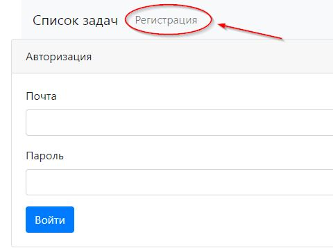
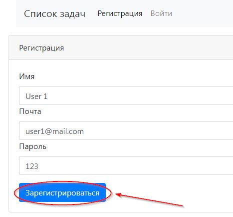
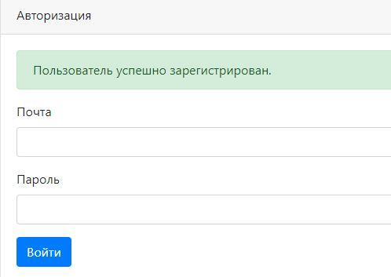
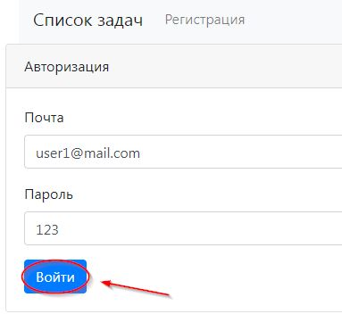
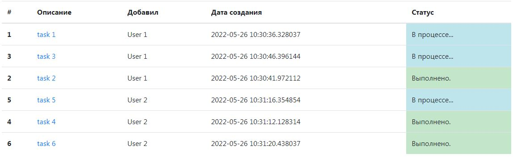
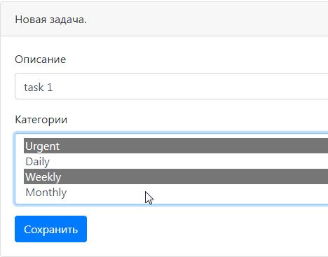
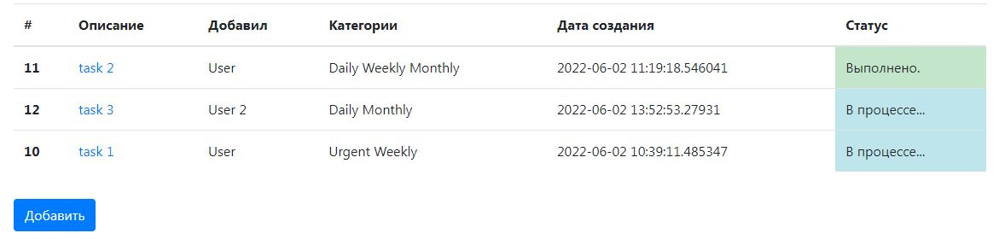

# TODO список.

## Общая информация

Проект разработан с целью улучшения навыков работы с различными стеками технологий и представляет
собой веб сервис для отслеживания задач.
При необходимости функционал проекта можно расширить.

## Запуск проекта

Для корректной работы приложения необходимо установить следующие программы:

- Java 16 или выше;
- PostgreSQL 14 или выше;
- Apache Maven 3.8.3 или выше.

1. Настройка postgreSQL. В терминале набрать следующие команды:

- Ввести логин. Вместо username указать свой;
```bash
  psql --username <username>
```
- Ввести пароль;
- Создать базу данных.
```bash
  create database todo;
```

2. Запуск при помощи maven. В терминале набрать следующие команды:
```
  mvn spring-boot:run
```

При необходимости запустить liquibase для создания таблиц в БД.
```
  mvn liquibase:update
```

## Пример функционирования сервиса.

### 1. Добавление задачи:

Для того чтобы добавить задачу, необходимо нажать кнопку "Добавить".

<details>
    <summary>Пример:</summary>
    
</details>

Далее необходимо заполнить поле с описанием задачи и нажать на кнопку "Сохранить".

<details>
    <summary>Пример:</summary>
    
</details>

После этого произойдет перенаправление на страницу со списком всех задач.

<details>
    <summary>Пример:</summary>
    
</details>

### 2. Информация о задаче.

Информацию о задаче можно посмотреть, если в списке задач нажать на описание конкретной задачи.

<details>
    <summary>Пример:</summary>
    
</details>

Пользователь будет перенаправлен на страницу с описанием.

На странице с информацией доступно три функции:

- Изменить статус задачи на "Выполнено";
- Отредактировать задачу;
- Удалить задачу.

#### Редактирование:

Для того чтобы отредактировать описание задачи, необходимо нажать на кнопку "Редактировать".

<details>
    <summary>Пример:</summary>
    
</details>

Пользователь будет перенаправлен на страницу с редактированием описания. После внесения изменений
необходимо нажать кнопку "Сохранить".

<details>
    <summary>Пример:</summary>
    
</details>

После сохранения изменений произойдет перенаправление на страницу с информацией о задаче, на которой 
отобразится новая информация.

#### Статус "Выполнено":

Статус задачи можно сменить с "В процессе..." на "Выполнено". Для этого необходимо нажать соответствующую
кнопку на странице с информацией о задаче.

<details>
    <summary>Пример:</summary>
    
</details>

Если у задачи статус "Выполнено", то редактирование для такой задачи становится недоступным, 
как и изменение статуса. Остается возможным только удалить задачу.

<details>
    <summary>Пример:</summary>
    
</details>

#### Удаление:

Удалить можно как выполненную задачу, так и задачу, которая находится в процессе выполнения. Для этого
необходимо нажать соответствующую кнопку "Удалить".

<details>
    <summary>Пример:</summary>
    
</details>

После удаления, пользователь будет перенаправлен на страницу со списком всех задач.

### 3. Фильтрация:

Отображать можно как весь список задач, так и выполненные и не выполненный задачи по отдельности. Для этого
нужно выбрать соответствующий раздел в навигационном меню.

<details>
    <summary>Пример:</summary>
    
</details>

В разделе "Выполненные" отображаются выполненные задачи, в разделе "Новые" соответственно не выполненные.

<details>
    <summary>Пример:</summary>
    
    
</details>

### 4. Регистрация/Авторизация пользователя:

*Добавлено 26.05.2022.*

Теперь для работы с сервисом, пользователь должен авторизоваться с помощью почты и пароля, 
указанных при регистрации.

Если это первое посещение, то пользователю необходимо зарегистрироваться. Для этого необходимо перейти на страницу
регистрации в левом верхнем углу страницы.

<details>
    <summary>Пример:</summary>
    
</details>

Для регистрации необходимо указать следующие данные заполнив соответствующие поля:

- Имя пользователя;
- Электронную почту;
- Пароль.

После чего нажать кнопку "Зарегистрироваться".

<details>
    <summary>Пример:</summary>
    
</details>

После регистрации пользователь будет перенаправлен на страницу авторизации с сообщением об успешной регистрации. 

<details>
    <summary>Пример:</summary>
    
</details>

Для авторизации необходимо указать почту и пароль, после чего нажать кнопку "Войти".

<details>
    <summary>Пример:</summary>
    
</details>

Если пользователь с такой почтой уже зарегистрирован, то будет выведено соответствующее сообщение с предложением 
указать другие данные.

<details>
    <summary>Пример:</summary>
    
</details>

Теперь в списке задач отображается, какой пользователь добавил задачу.

<details>
    <summary>Пример:</summary>
    
</details>

### 5. Категории:

*Добавлено 02.06.22*

Добавлена возможность указывать к какой категории относится задача. При создании новой задачи необходимо
выбрать одну или несколько категорий с помощью ctrl/shift + click.

<details>
    <summary>Пример:</summary>
    
</details>

Выбранные категории отображаются в соответствующей колонке таблицы.

<details>
    <summary>Пример:</summary>
    
</details>

## Технологии

[](https://www.java.com/)
[](https://maven.apache.org/)
[](https://spring.io/projects/spring-boot)
[](https://www.postgresql.org/)

[](https://github.com/alxkzncoff/job4j_todo/actions)