# TODO список.

Сервис для отслеживания задач.

## Пример функционирования сервиса.

### 1. Добавление задачи:

Для того чтобы добавить задачу, необходимо нажать кнопку "Добавить".

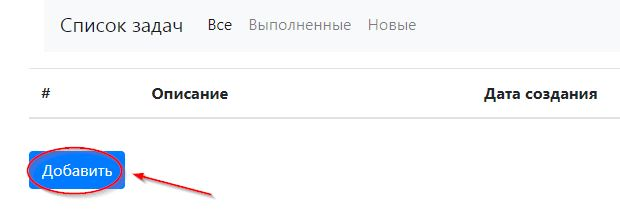

Далее необходимо заполнить поле с описанием задачи и нажать на кнопку "Сохранить".

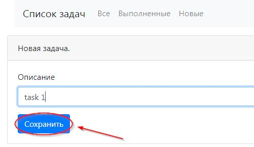

После этого произойдет перенаправление на страницу со списком всех задач.

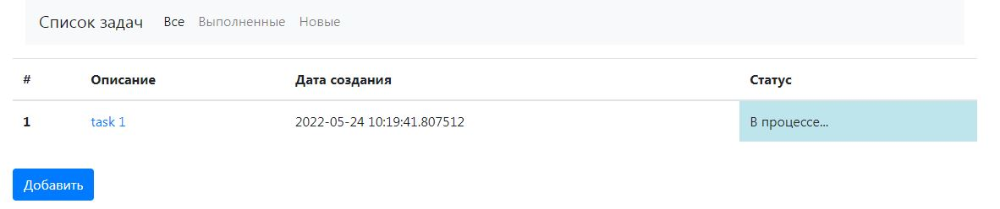

### 2. Информация о задаче.

Информацию о задаче можно посмотреть, если в списке задач нажать на описание конкретной задачи.

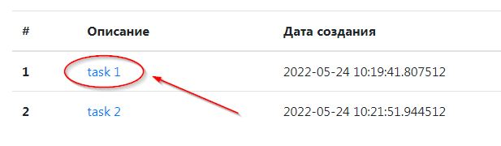

Пользователь будет перенаправлен на страницу с описанием.

На странице с информацией доступно три функции:

- Изменить статус задачи на "Выполнено";
- Отредактировать задачу;
- Удалить задачу.

#### Редактирование:

Для того чтобы отредактировать описание задачи, необходимо нажать на кнопку "Редактировать".

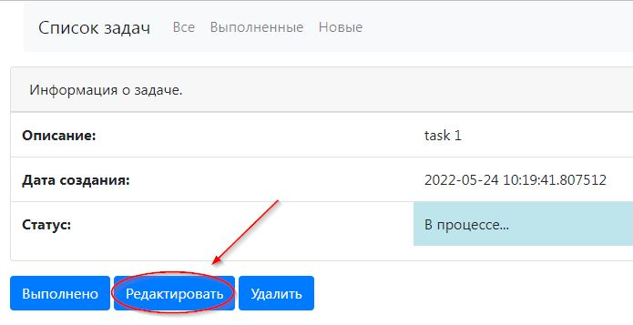

Пользователь будет перенаправлен на страницу с редактированием описания. После внесения изменений
необходимо нажать кнопку "Сохранить".

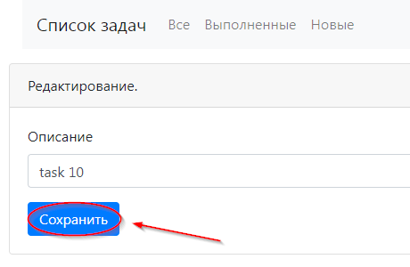

После сохранения изменений произойдет перенаправление на страницу с информацией о задаче, на которой 
отобразится новая информация.

#### Статус "Выполнено":

Статус задачи можно сменить с "В процессе..." на "Выполнено". Для этого необходимо нажать соответствующую
кнопку на странице с информацией о задаче.

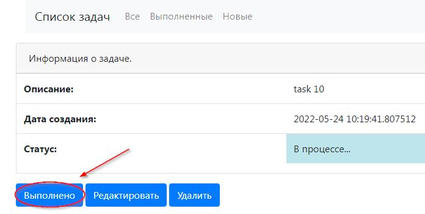

Если у задачи статус "Выполнено", то редактирование для такой задачи становится недоступным, 
как и изменение статуса. Остается возможным только удалить задачу.

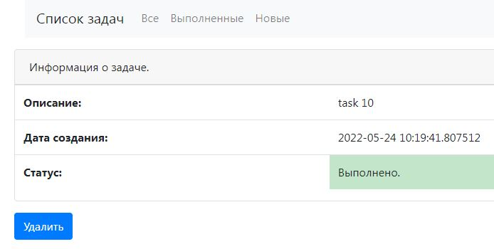

#### Удаление:

Удалить можно как выполненную задачу, так и задачу, которая находится в процессе выполнения. Для этого
необходимо нажать соответствующую кнопку "Удалить".

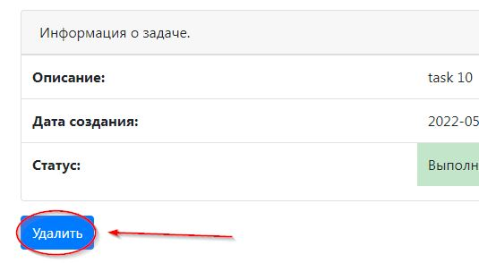

После удаления, пользователь будет перенаправлен на страницу со списком всех задач.

### 3. Фильтрация:

Отображать можно как весь список задач, так и выполненные и не выполненный задачи по отдельности. Для этого
нужно выбрать соответствующий раздел в навигационном меню.

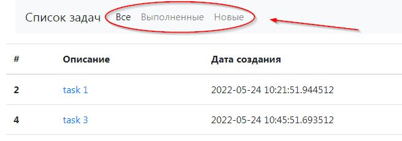

В разделе "Выполненные" отображаются выполненные задачи, в разделе "Новые" соответственно не выполненные.

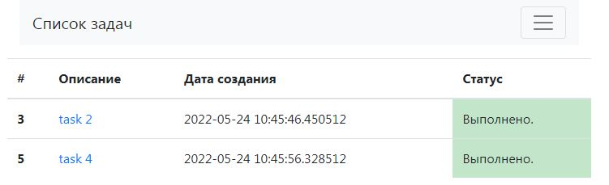

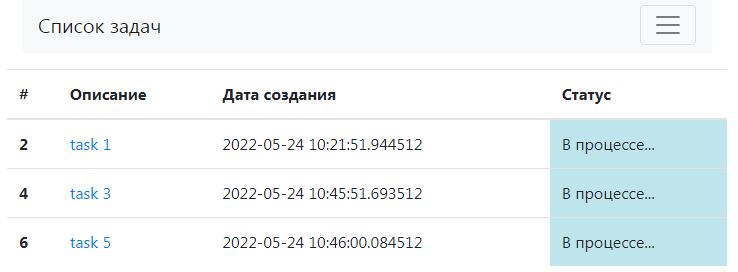

